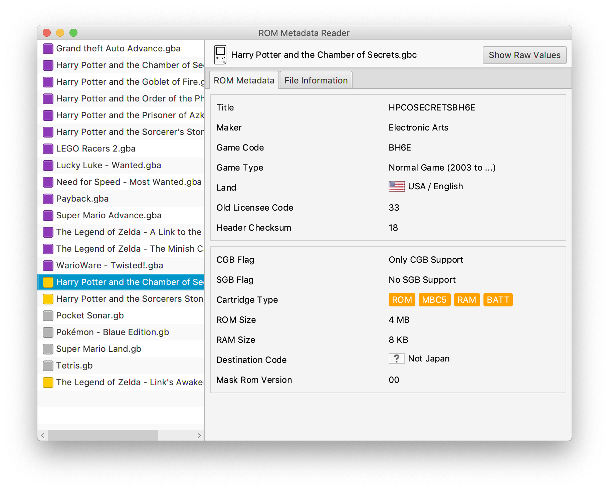
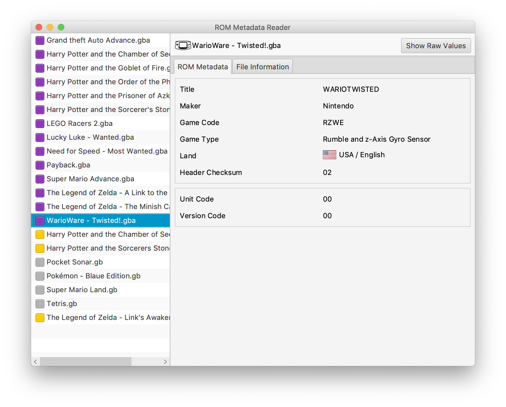

# ROM Metadata Reader

A tool to read metadata from ROM files. It has support for ROM files from the following consoles:

1. Nintendo Game Boy (GB)
2. Nintendo Game Boy Color (GBC)
3. Nintendo Super Game Boy (SGB)
4. Nintendo Game Boy Advance (GBA)
5. Nintendo DS (NDS)

## Preview

## Installation

## Usage

## Credits

- Custom CSS styles for the scrollbars and the toolbar are taken from [Markdown Writer FX](https://github.com/JFormDesigner/markdown-writer-fx) by Karl Tauber.
- The icons *gb*, *gba*, *gbc* and *nds* are made by [David Pérez](https://thenounproject.com/david730/) and licensed as Creative Commons CCBY.

Third party licenses are located in the resources folder at [src/main/resources/licenses/](src/main/resources/licenses/).

## License

This project is open source licensed under the BSD 3-Clause License. Please see the [LICENSE file](LICENSE) for more information.
